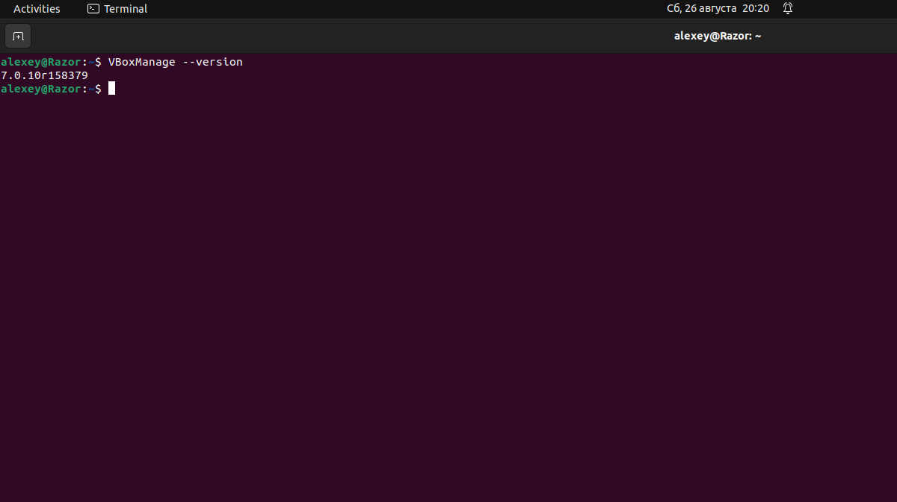
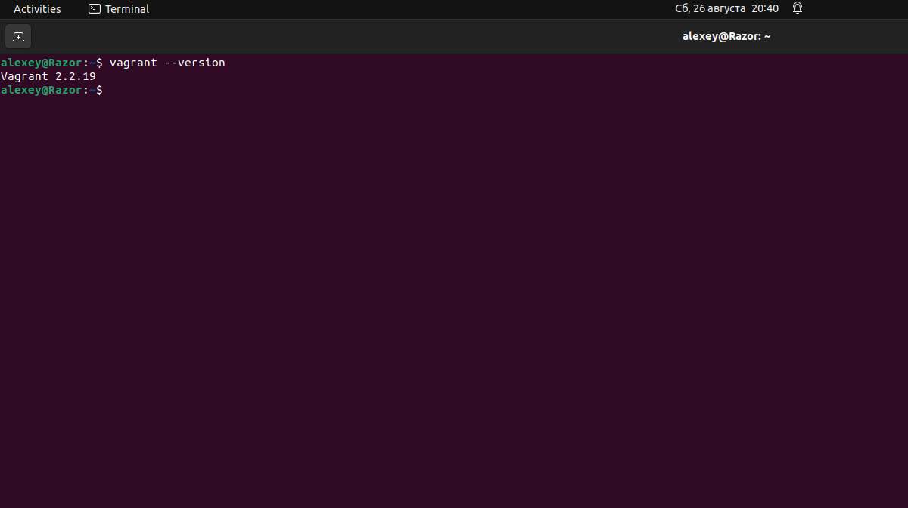
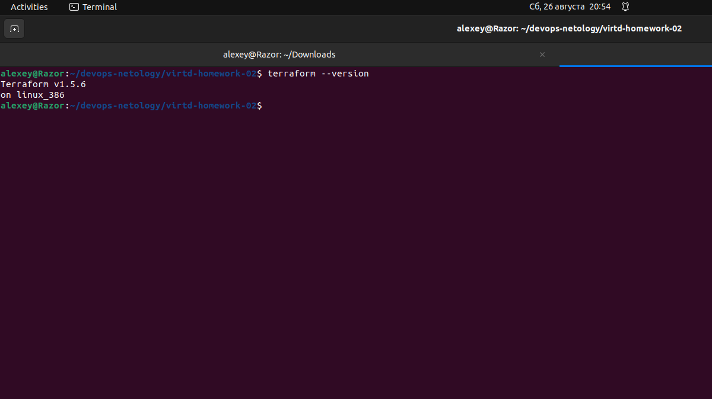
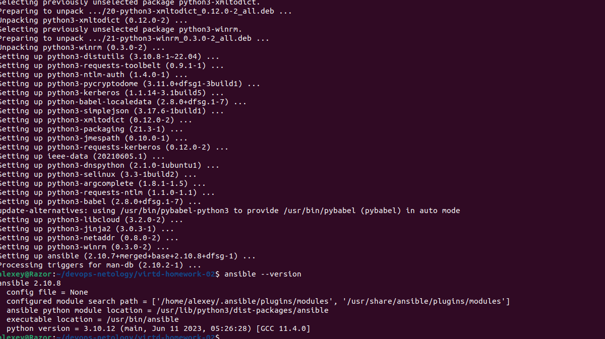
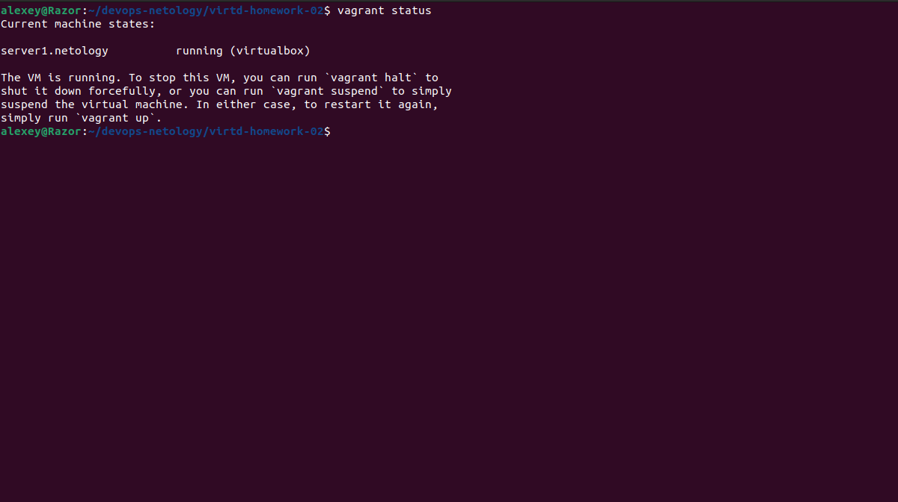
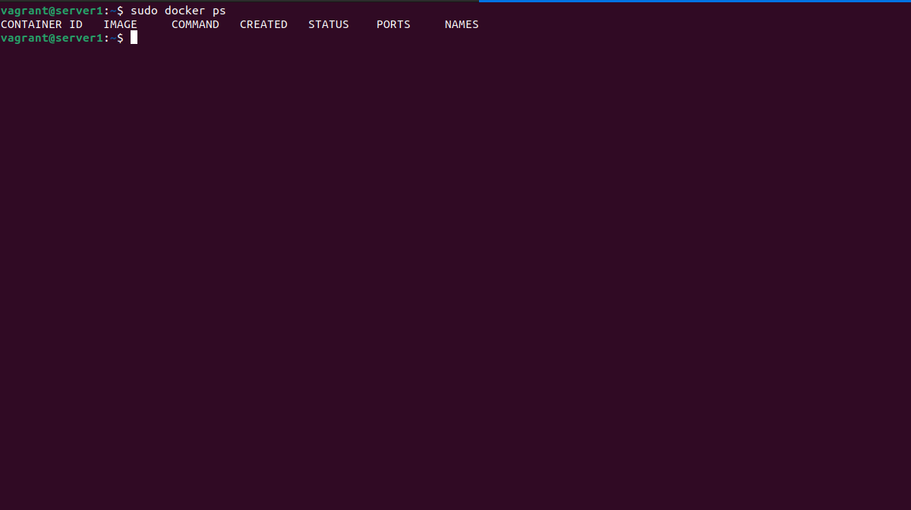

Задание 1
Опишите основные преимущества применения на практике IaaC-паттернов.
Какой из принципов IaaC является основополагающим?

Ответ

Преимуществ несколько:
Инфраструктура как код имеет версионность (т.к. все версии конфигураций можно хранить в коде и быстро переключаться), соответственно можно автоматизировать развертывание и конфигурирование инфраструктуры. Ранее созданные среды легко воспроизвести если они описаны в коде, также становится возможной одновременная работа над кодом инфраструктуры несколькими специалистами. Подход Инфраструктура как код выглядит надежнее, если произошел какой-либо сбой можно упростить восстановление систем (из ранее сохраненных конфигураций). Также системы легче масштабировать, т.к. можно легко добавлять новые узлы системы (то есть скорость развертывания существенно возрастает - не нужно делать ручных настроек например). Версионность позволяет например быстро откатить на более стабильную версию узлы инфраструктуры.

Основополагающим принципом IaaC является обеспечение развертывания структуры по аналогии с созданием программного продукта в репозитории. То есть декларирование инфраструктуры происходит в виде кода в репозитории.

Задание 2

Чем Ansible выгодно отличается от других систем управление конфигурациями?
Какой, на ваш взгляд, метод работы систем конфигурации более надёжный — push или pull?

Ответ

Ansible не имеет агнтского модуля, то есть не нужно ничего дополнительно разворачивать. Конфигурации хранятся в файле YAML, в понятном виде и не требует специфичных навыков программированияю - то есть снижается порог входа для специалистов.

# Доработка после комментариев преподавателяэ

Pull метод более стабилен к потере соединения,т.к. узлы будут работать на старых версиях пока не обновятся. То есть при Pull методе узлы сами контролируют обновление и способны продолжить обновление при потере соединений.
У push модели не смотря на преимущства, могут возникнуть сценарии при обрыве подключения. То есть могут возникнуть ситуации с не обновленными и рассогласованными узлами. 

Задание 3
Установите на личный компьютер:
VirtualBox,
Vagrant,
Terraform,
Ansible.
Приложите вывод команд установленных версий каждой из программ, оформленный в Markdown.

Ответ

VirtualBox

Vagrant

Terraform

Ansible

Задание 4

Ответ:
установленный сервер Ubuntu 20

Установленный докер из Ansible
